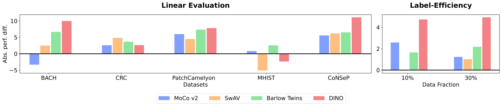

# Benchmarking Self-Supervised Learning on Diverse Pathology Datasets

Official PyTorch Implementation and pre-trained models for `Benchmarking Self-Supervised Learning on Diverse Pathology Datasets` (accepted in CVPR 2023).

[[`Project page`]](https://lunit-io.github.io/research/publications/pathology_ssl/) [[`arxiv`]](https://arxiv.org/abs/2212.04690)

# Abstract



Computational pathology can lead to saving human lives, but models are annotation hungry and pathology images are notoriously expensive to annotate. Self-supervised learning has shown to be an effective method for utilizing unlabeled data, and its application to pathology could greatly benefit its downstream tasks. Yet, there are no principled studies that compare SSL methods and discuss how to adapt them for pathology. To address this need, we execute the largest-scale study of SSL pre-training on pathology image data, to date. Our study is conducted using 4 representative SSL methods on diverse downstream tasks. We establish that large-scale domain-aligned pre-training in pathology consistently out-performs ImageNet pre-training in standard SSL settings such as linear and fine-tuning evaluations, as well as in low-label regimes. Moreover, we propose a set of domain-specific techniques that we experimentally show leads to a performance boost. Lastly, for the first time, we apply SSL to the challenging task of nuclei instance segmentation and show large and consistent performance improvements under diverse settings.


# Pre-trained weights
We provide SSL weights of ResNet50 and ViT-S backbone pre-trained on 19M patches using TCGA data source. Note that, all weights are pre-trained for 200 ImageNet epochs and available [here](https://github.com/lunit-io/benchmark-ssl-pathology/releases/tag/pretrained-weights). Please, see below example for using pre-trained weights.

## ResNet50-based weights
```python
import torch
from torchvision.models.resnet import Bottleneck, ResNet


class ResNetTrunk(ResNet):
    def __init__(self, *args, **kwargs):
        super().__init__(*args, **kwargs)
        del self.fc  # remove FC layer

    def forward(self, x):
        x = self.conv1(x)
        x = self.bn1(x)
        x = self.relu(x)
        x = self.maxpool(x)

        x = self.layer1(x)
        x = self.layer2(x)
        x = self.layer3(x)
        x = self.layer4(x)
        return x


def get_pretrained_url(key):
    URL_PREFIX = "https://github.com/lunit-io/benchmark-pathology-ssl/releases/download/pretrained-weights"
    model_zoo_registry = {
        "BT": "bt_rn50_ep200.torch",
        "MoCoV2": "mocov2_rn50_ep200.torch",
        "SwAV": "swav_rn50_ep200.torch",
    }
    pretrained_url = f"{URL_PREFIX}/{model_zoo_registry.get(key)}"
    return pretrained_url


def resnet50(pretrained, progress, key, **kwargs):
    model = ResNetTrunk(Bottleneck, [3, 4, 6, 3], **kwargs)
    if pretrained:
        pretrained_url = get_pretrained_url(key)
        verbose = model.load_state_dict(
            torch.hub.load_state_dict_from_url(pretrained_url, progress=progress)
        )
        print(verbose)
    return model


if __name__ == "__main__":
    # initialize resnet50 trunk using BT pre-trained weight
    model = resnet50(pretrained=True, progress=False, key="BT")
```

## ViT/S-based weights
```python
import torch
from timm.models.vision_transformer import VisionTransformer


def get_pretrained_url(key):
    URL_PREFIX = "https://github.com/lunit-io/benchmark-pathology-ssl/releases/download/pretrained-weights"
    model_zoo_registry = {
        "DINO_p16": "dino_vit_small_patch16_ep200.torch",
        "DINO_p8": "dino_vit_small_patch8_ep200.torch",
    }
    pretrained_url = f"{URL_PREFIX}/{model_zoo_registry.get(key)}"
    return pretrained_url


def vit_small(pretrained, progress, key, **kwargs):
    patch_size = kwargs.get("patch_size", 16)
    model = VisionTransformer(
        img_size=224, patch_size=patch_size, embed_dim=384, num_heads=6, num_classes=0
    )
    if pretrained:
        pretrained_url = get_pretrained_url(key)
        verbose = model.load_state_dict(
            torch.hub.load_state_dict_from_url(pretrained_url, progress=progress)
        )
        print(verbose)
    return model


if __name__ == "__main__":
    # initialize ViT-S/16 trunk using DINO pre-trained weight
    model = vit_small(pretrained=True, progress=False, key="DINO_p16", patch_size=16)
```
# Update log
- [2023.04.18] Make pre-trained weights available
- [WIP] Releasing the implementation of RandStainNA + GMM

# License
Pre-trained weights in this repository are bound by ''Public License'' issued from Lunit Inc.
Note that, the weights must be used non-commercially, meaning that the weights must be used for research-only purpose.
Please, see the detail [here](https://github.com/lunit-io/benchmark-ssl-pathology/blob/main/LICENSE).

# Acknowledgement
We built pre-trained weights using [VISSL](https://github.com/facebookresearch/vissl) and used official PyTorch implementation of HoVer-Net [here](https://github.com/vqdang/hover_net).

# Citation
```
@inproceedings{kang2022benchmarking,
  author={Kang, Mingu and Song, Heon and Park, Seonwook and Yoo, Donggeun and Pereira, Sérgio},
  title={Benchmarking Self-Supervised Learning on Diverse Pathology Datasets},
  booktitle={Proceedings of the IEEE/CVF Conference on Computer Vision and Pattern Recognition (CVPR)},
  month={June},
  year={2023},
  pages={TBU}
}
```
